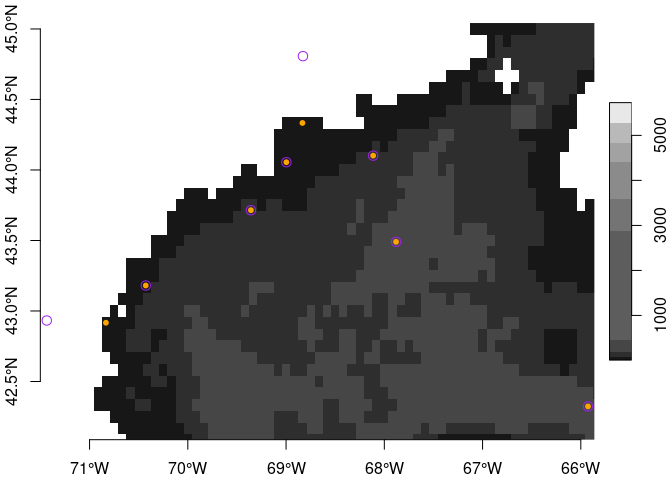

andreas
================

Andreas (Andrew) Copernicus was the lesser known brother of [Nicolaus
Copernicus](https://en.wikipedia.org/wiki/Nicolaus_Copernicus). This
package serves as suite of functions and scripts to access and manage
data from the [Copernicus Marine Data
Store](https://data.marine.copernicus.eu/products). This package
leverages the tools provided by the [`copernicus` R
package](https://github.com/BigelowLab/copernicus).

This document is divided into two parts: “Fetching Remote Data” and
“Working with Local Archives”. You don’t need to fetch data is you
already have a local archive.

# Fetching Remote Data

You only need this part if you are creating or maintaining a local
archive of data. See this
[wiki](https://github.com/BigelowLab/andreas/wiki/Fetching-a-new-data)
page for an example of building a local dataset.

# Working with Local Archives

For most needs, you are interested in working with a previously
downloaded dataset.

## The local archive

The local archive is a collection of one or more products (and their
datasets) for a particular region of the world. For example, we have an
archive for the Northwest Atlantic that extends from Cape Hatteras to
Flemish Cap (“chfc”). The archive is a directory called “chfc” within
which there is one subdirectory for each product. Within each product
directory there may be series of subdirectories organized by year
(*e.g.* “2022”) and then by month-day (*e.g.* “0521”). Within the
month-day subdirectories there will be one or more GeoTIFF files (one
file for each variable).  
At the product level you will find a text-based file called “database”.
It is a comma delimited file that (in theory) keeps track of the files
that have been archived. We leverage this database to quickly find a
subset of the entire database.

### Using the database

The database is very light and easy to filter for just the records you
might need. Note that depth is a character data type; this provides you
with flexibility to define depth as ‘surface’ or ‘50-75’ or something
like that.

Let’s walk through reading the database, filtering it for a subset,
reading the files and finally displaying.

``` r
suppressPackageStartupMessages({
  library(andreas)
  library(copernicus)
  library(dplyr)
  library(stars)
  library(twinkle)
})

path = copernicus::copernicus_path("chfc", "GLOBAL_ANALYSISFORECAST_PHY_001_024")
db <- andreas::read_database(path) |>
  dplyr::glimpse()
```

    ## Rows: 11,340
    ## Columns: 7
    ## $ id        <chr> "cmems_mod_glo_phy-cur_anfc_0.083deg_P1D-m", "cmems_mod_glo_…
    ## $ date      <date> 2025-06-23, 2025-06-24, 2025-06-25, 2025-06-26, 2025-06-27,…
    ## $ time      <chr> "000000", "000000", "000000", "000000", "000000", "000000", …
    ## $ depth     <chr> "sur", "sur", "sur", "sur", "sur", "sur", "sur", "sur", "sur…
    ## $ period    <chr> "day", "day", "day", "day", "day", "day", "day", "day", "day…
    ## $ variable  <chr> "uo", "uo", "uo", "uo", "uo", "uo", "uo", "uo", "uo", "uo", …
    ## $ treatment <chr> "raw", "raw", "raw", "raw", "raw", "raw", "raw", "raw", "raw…

It may look complicated, but this permits the storage of multiple
datasets per product, and is a very flexible system.

``` r
db |> dplyr::count(id, depth, variable)
```

    ## # A tibble: 10 × 4
    ##    id                                           depth variable     n
    ##    <chr>                                        <chr> <chr>    <int>
    ##  1 cmems_mod_glo_phy-cur_anfc_0.083deg_P1D-m    sur   uo        1134
    ##  2 cmems_mod_glo_phy-cur_anfc_0.083deg_P1D-m    sur   vo        1134
    ##  3 cmems_mod_glo_phy-so_anfc_0.083deg_P1D-m     sur   so        1134
    ##  4 cmems_mod_glo_phy-thetao_anfc_0.083deg_P1D-m sur   thetao    1134
    ##  5 cmems_mod_glo_phy-wcur_anfc_0.083deg_P1D-m   sur   wo        1134
    ##  6 cmems_mod_glo_phy_anfc_0.083deg_P1D-m        bot   pbo       1134
    ##  7 cmems_mod_glo_phy_anfc_0.083deg_P1D-m        bot   sob       1134
    ##  8 cmems_mod_glo_phy_anfc_0.083deg_P1D-m        bot   tob       1134
    ##  9 cmems_mod_glo_phy_anfc_0.083deg_P1D-m        mld   mlotst    1134
    ## 10 cmems_mod_glo_phy_anfc_0.083deg_P1D-m        zos   zos       1134

#### Filtering the database

Next we can filter the database to select just a few variables and
dates.

``` r
db = db |>
  dplyr::filter(variable %in% c("uo", "vo"),
                dplyr::between(date, as.Date("2024-07-01"), as.Date("2024-07-04")))
db
```

    ## # A tibble: 8 × 7
    ##   id                            date       time  depth period variable treatment
    ##   <chr>                         <date>     <chr> <chr> <chr>  <chr>    <chr>    
    ## 1 cmems_mod_glo_phy-cur_anfc_0… 2024-07-01 0000… sur   day    uo       raw      
    ## 2 cmems_mod_glo_phy-cur_anfc_0… 2024-07-01 0000… sur   day    vo       raw      
    ## 3 cmems_mod_glo_phy-cur_anfc_0… 2024-07-02 0000… sur   day    uo       raw      
    ## 4 cmems_mod_glo_phy-cur_anfc_0… 2024-07-02 0000… sur   day    vo       raw      
    ## 5 cmems_mod_glo_phy-cur_anfc_0… 2024-07-03 0000… sur   day    uo       raw      
    ## 6 cmems_mod_glo_phy-cur_anfc_0… 2024-07-03 0000… sur   day    vo       raw      
    ## 7 cmems_mod_glo_phy-cur_anfc_0… 2024-07-04 0000… sur   day    uo       raw      
    ## 8 cmems_mod_glo_phy-cur_anfc_0… 2024-07-04 0000… sur   day    vo       raw

#### Reading rasters

Now we can read in the files.

``` r
s = andreas::read_andreas(db, path)
s
```

    ## stars object with 3 dimensions and 2 attributes
    ## attribute(s):
    ##          Min.     1st Qu.       Median        Mean    3rd Qu.     Max.   NA's
    ## uo  -1.326024 -0.05049612  0.051139427 0.091540550 0.17146044 2.269631 137928
    ## vo  -2.188372 -0.09885015 -0.009427601 0.002213373 0.08936314 1.876243 137928
    ## dimension(s):
    ##      from  to         offset    delta  refsys x/y
    ## x       1 415         -77.04  0.08333  WGS 84 [x]
    ## y       1 261          56.71 -0.08333  WGS 84 [y]
    ## time    1   4 2024-07-01 UTC   1 days POSIXct

#### Extracting point data

It’s pretty easy to extract values at various points. We provide a
sample of sites (some buoys and two airports). Below we can extract
point data in long form.

``` r
sites = read_buoys()
values = extract_points(s, sites)
values
```

    ## # A tibble: 64 × 4
    ##    point name  time                   value
    ##    <chr> <chr> <dttm>                 <dbl>
    ##  1 p1    uo    2024-07-01 00:00:00  0.0317 
    ##  2 p1    uo    2024-07-02 00:00:00 -0.00288
    ##  3 p1    uo    2024-07-03 00:00:00  0.0914 
    ##  4 p1    uo    2024-07-04 00:00:00  0.150  
    ##  5 p2    uo    2024-07-01 00:00:00  0.169  
    ##  6 p2    uo    2024-07-02 00:00:00  0.0770 
    ##  7 p2    uo    2024-07-03 00:00:00  0.222  
    ##  8 p2    uo    2024-07-04 00:00:00  0.218  
    ##  9 p3    uo    2024-07-01 00:00:00 -0.0961 
    ## 10 p3    uo    2024-07-02 00:00:00 -0.0656 
    ## # ℹ 54 more rows

Or we can do the same in wide format.

``` r
values = extract_points(s, sites, form = "wide")
values
```

    ## # A tibble: 32 × 4
    ##    point time                      uo      vo
    ##    <chr> <dttm>                 <dbl>   <dbl>
    ##  1 p1    2024-07-01 00:00:00  0.0317   0.114 
    ##  2 p1    2024-07-02 00:00:00 -0.00288  0.123 
    ##  3 p1    2024-07-03 00:00:00  0.0914   0.117 
    ##  4 p1    2024-07-04 00:00:00  0.150    0.130 
    ##  5 p2    2024-07-01 00:00:00  0.169   -0.0172
    ##  6 p2    2024-07-02 00:00:00  0.0770   0.0386
    ##  7 p2    2024-07-03 00:00:00  0.222    0.0397
    ##  8 p2    2024-07-04 00:00:00  0.218    0.0299
    ##  9 p3    2024-07-01 00:00:00 -0.0961  -0.0462
    ## 10 p3    2024-07-02 00:00:00 -0.0656  -0.0612
    ## # ℹ 22 more rows

If you explore the data you’ll notice that the last two points (both
airports) return NA values which is expected for a marine data set.

### Static variables

Some products have static variables (model coordinates, depth, mask,
etc). We don’t retain any on a usual basis except for `deptho`, `mask`
and `deptho_lev` (model level at bottom). We augment the base variables
with a look up table, `lut`, which maps land-based pixels to their
nearest water-based pixel. Others include `TPI`, `TRI`, `roughness`,
`slope` and `aspect`. Learn more about those
[here](https://rspatial.github.io/terra/reference/terrain.html).

You can read static variables easily by providing just the variable
names and the data path.

``` r
static = read_static(name = c("mask", "deptho"), path = path)
static
```

    ## stars object with 2 dimensions and 2 attributes
    ## attribute(s):
    ##            Min.  1st Qu.   Median         Mean  3rd Qu.     Max.  NA's
    ## mask    0.00000   0.0000    1.000    0.6816507    1.000    1.000     0
    ## deptho  7.92956 266.0403 3597.032 2992.1398081 4833.291 5727.917 34482
    ## dimension(s):
    ##   from  to offset    delta refsys point x/y
    ## x    1 415 -77.04  0.08333 WGS 84 FALSE [x]
    ## y    1 261  56.71 -0.08333 WGS 84 FALSE [y]

#### Remapping points located over land

The `lut` is useful when you are extracting point data from rasters, but
some (or all!) of your points are close to water but not over water. The
location of an animal washed up on a beach is a classic example (or a
sturgeon report from nearshore) - they just miss being located over a
“wet” pixel. It happens. Here’s how you can find the closest available
“wet” pixel given one or more points (some of which are on shore.) The
original locations are shown with open purple circles, and the remapped
locations are shown with closed orange circles.

``` r
lut = read_static(name = "lut", path = path)
y = remap_to_water_pixel(sites, lut)

plot(static['deptho'], axes = TRUE, reset = FALSE, 
     extent = sf::st_union(sites) |> sf::st_buffer(dist = 5000), 
     main = "")
points(sites, pch = 1, col = "purple", cex = 1.3)
points(y, pch = 20, col = "orange")
```

<!-- -->
